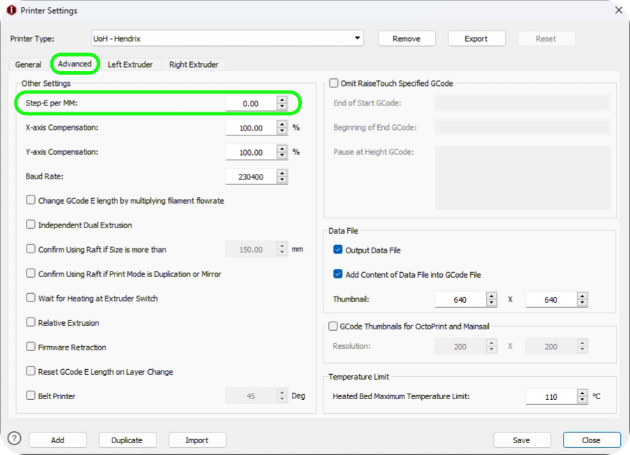

In my previous [guide](/content/3D%20Printing/Filament%20Calibration/index.md), it ran through how to configure a filament using OrcaSlicer.
Whilst this is good for hobbyist printers such as a printer like my personal Ender3v2, it is something that does not necessarily work on all printers.
Cura is the most commonly used slicer that is not behind a firewall, however for printers that I run at the University, they use a different slicing software.
Therefore, this guide will dive into how to configure a 3D printer with IdeaMaker, using the Raise3D Pro 2 printer.

# 3D printer calibration steps 

## Extruder calibration
One of the first steps that has been neglected thus far in my other guides is the calibration of the extruder. 
A full guide on how to calibrate this will be posted soon.

Calibrating the extruder is one of the most important aspects of 3D printing asn something that I find myself doing on a regular basis.
By calibrating the extruder, it ensures that the amount of filament requested by the printer is the same amount of filament extruded.

Once the extruder has been calibrated, ender the value into your filament profile in IdeaMaker.

This can be found under `Printer settings -> Advacned -> Step-E per MM`

## Flow rate calibration
Flow rate has been covered before but the process is slightly different in IdeaMaker.
Flow rate should be calibrated for each type of filament that  is being printed and is different on all filaments, even if it is the same type of filament.
Most of the time, you will find that the values do not differentiate that much between filament and could be left, but it is best practice to calibrate this every time.

To do this a guide will be posted soon showing how to calibrate the flow rate.
After the calibration values have been identified for the specific filament, it can be inserted into IdeaMaker.

This setting can be found under: `Template Settings -> Advanced -> Primary Filament Flowrate`. 
To ensure that this setting takes effect when printing, the `Override Filament Setting` must be checked.

## Temperature calibration
The next step of calibration is the calibrating the temperature, this can be done by importing a temperature tower into IdeaMaker.
When 3D printing, you will find that each filament reacts slightly different at various temperatures and finding the most appropriate temperature will provide the best properties.
This is something that will need to be considered when changing filament type (i.e. PLA - PETG), but it might also have an impact on colour  of the same filament type.

Finding the best temperature for the selected filament will ensure that there is the best print quality and best layer adhesion providing the best strength for a part.
After calibrating the temperature for the filament, you will be able to assess the best temperature which can be used for your prints.

The temperature tower in IdeaMaker is a little more finicky and requires a little more effort to set up compared to other slicers such as OrcaSlicer or Cura.
IdeaMaker will require you to manually change the hot end temperature for each layer of the tower.

The calibration method on other slicers uses a fork of the [gaaZolee smart temperature tower](https://www.thingiverse.com/thing:2729076), however if you want to save time you can download this [pre-set tower](Temperature-Calibration-Tower.zip).
This guide will still run through how to calibrate the tower manually so that you have an understanding for future reference.

Once the model has been imported into IdeaMaker, select the model and navigate through `Group and Layer Settings -> Setting Group 1`.
After this you can hit the [+] symbol to add a new setting into the model. 
From here you an adjust the min and max layer height of the section; once this has been set, the pen function will allow you to edit the layer settings.
In the search bar, type `Temperature` and make sure that the `Left Extruder` has been checked, this will then allow you to set the temperature of the tower for that section.

This process can then be repeated for all of the remaining layers of the model. 

Once the tower has been printed you can inspect the tower to find the best layer temperature. 
This can be done by choosing the section which looks the best and has the most detail. 
You should ignore the stringing elements at this point as the retraction of the filament may not be correct at this stage of calibration.
This will be calibrated in the next section of this guide.

## Retraction calibration
Progressing onto the next stage of calibration we will cover the retraction settings for a filament.
This is important to do straight after the temperature calibration; this is due to the values of the retraction test can change according to the temperature.

Retraction is the extruder minimising the pressure in the nozzle. 
If there is no pressure inside the nozzle, filament will ooze out of the nozzle and leave a stringing effect on the prints, this is due to gravity.

There are two types of extruder assembly; direct drive and bowden set-ups.
For direct drive setups, the retraction settings is generally between 0.2mm and 2.0mm.
For bowden set-ups it is in the ball part of 0.5mm to 5mm.

The retraction test can be configured in a similar way to the temperature tower however when configuring the per-layer settings, change the `Retraction Material Amount` under the left extruder.
You can also download a retraction file from [here](Retraction-Calibration-Tower.zip).

To update the retraction value, navigate to:

`Advanced settings -> Extruder -> Retraction Material Amount`

Retraction can be further tuned to eliminate the remaining stringing on a print but implementing coasting into the profile.

The coasting values stops the printer from extruding for a set value, before finishing the line it is printing. 
This way the remaining pressure in the nozzle will push a bit of filament through the nozzle when the extruder has stopped.

General rule of thumb is the bowden set-ups require 0.2mm to 0.4mm of coasting.
The way to identify if there is too much under-extrusion by the Z seam then the coasting value is too high; lower this value to fix this problem.
Coasting can be changed by going to:

`Advanced settings -> Extruder -> Coasting Distance`

Make sure that the `Apply Coasting on Grid Infill and Lines Solid Fill` setting has been enabled.

# Fine tuning

## Top and bottom layer flow rate
When the main bulk of the filament has been calibrated, the filament can be fine-tuned to really make strides in improving the print quality.
Over extrusion or under extrusion can be found in the top and bottom layer, this can be possible even if the flow rate of your filament has been configured properly. 

This setting can be overriden by changing the value in:

`Solid Fill -> Top Surface Solid Fill Flowerate`

`Solid Fill -> Bottom Surface Solid Fill Flowerate`

For this, a simple test can be done by printing out a simple shape such as a cube from the primitive menu and set the dimensions to 20mm cubed.

`Right Click -> Add Standard Primitive -> Cube`

Adjust the value for top and bottom layers and then upon inspection you can find the best value for your filament.
The adjustment of bottom flow rate can help with elephants foot if this is something you are struggling to mitigate.
Elephants foot is when the nozzle is too close to the bed or if the extruder is extruding too much filament on the first later.

## X and Y compensation
Once the top and bottom layers have been tuned and there is no elephants foot, the cube should have a high level of print quality.
However, the cube might not be the correct dimensions and therefore X and Y compensation can be induced in the filament settings.

The larger the cube printed, the easier it is to calculate the compensation as there will be a larger deficient. 
TO get the best measurement of the cube, measure the full length of the sube and not just the top and bottom.

The X and Y compensation can be adjusted by:

`Advanced settings -> Layer -> XY Size Compensation for Contours`

Remember when calculating the XY compensation that the over spill measurement from the calipers needs to be half.
E.g: If the measurement is 20.01mm on a 20.00mm cube, the adjustment would be 0.05mm. 

## Fix hole dimensions
One of the final aspects of calibrating your 3D printer is the hole dimensions.
Even though the printer is calibrated, sometimes the holes in the printed parts can be smaller than designed; this can be caused by material expansion of variances in the extrusion of the material.

For this XY Size Compensation for Holes can be used to adjust and compensate.

A simple test for this is push fitting a bearing into a part. If the bearing is too tight or lose then the compensation needs to be changed.

`Advanced settings -> Layer -> XY Size Compensatoin for Holes`